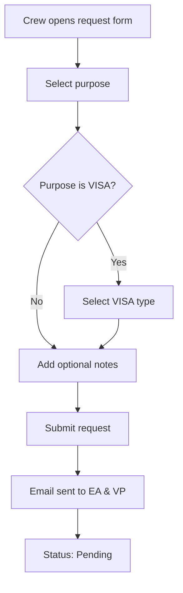
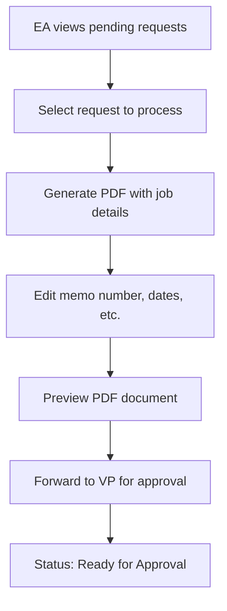
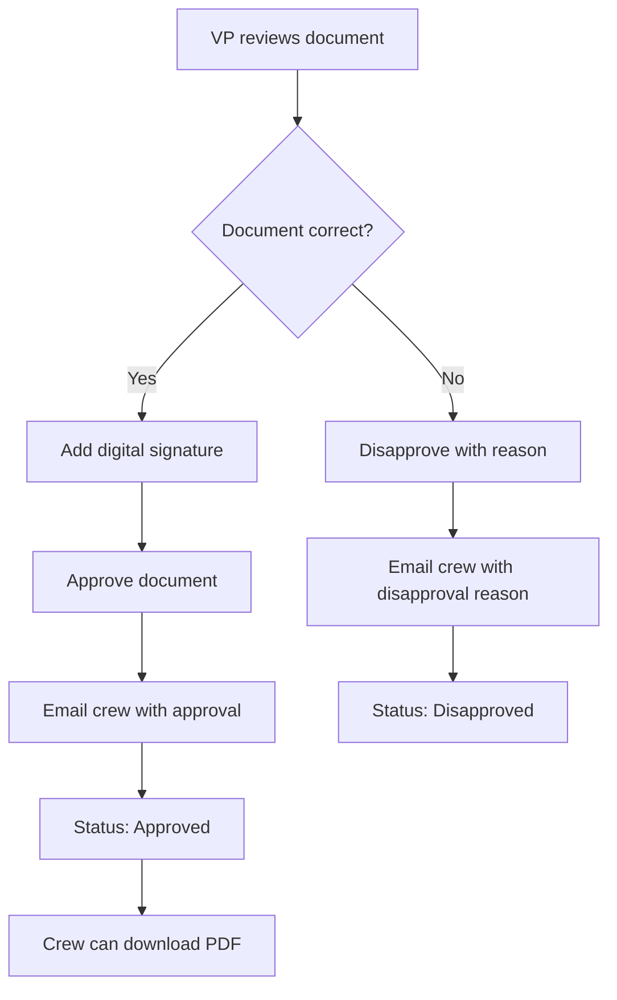

# Job Description Request Module - Implementation Guide

## 📊 Module Overview

The Job Description Request Module is a comprehensive system that allows seafarers to request official job description documents for various purposes (SSS, Pag-Ibig, PhilHealth, VISA applications). The module includes a complete workflow from request submission to document approval and download.

## 🏗️ Architecture

### Component Structure

```
src/components/job-description-module/
├── JobDescriptionRequestForm.tsx    # Form for creating requests
├── JobDescriptionStatus.tsx         # Status tracking component
├── PDFViewer.tsx                   # PDF generation/editing
├── index.ts                        # Exports
└── README.md                       # Detailed documentation
```

### Page Structure

```
src/app/
├── (crew)/job-description/page.tsx              # Crew interface
├── (admin)/admin/job-descriptions/page.tsx      # EA interface
└── (admin)/admin/job-descriptions/vp-approval/page.tsx  # VP interface
```

## 🔄 Workflow Process

### 1. Crew Request Submission



### 2. Executive Assistant Processing



### 3. Vice President Approval



## 🎯 Key Features

### Crew Features

- **Multi-Purpose Requests**: SSS, Pag-Ibig, PhilHealth, VISA
- **VISA Sub-Types**: Tourist, Business, Work, Transit, Student, Family, Seaman's
- **Request Tracking**: Visual progress indicators
- **Status History**: Complete request timeline
- **PDF Download**: Approved documents ready for download

### Admin Features (EA)

- **Request Dashboard**: Overview of all requests with status counts
- **PDF Generator**: Browser-based PDF creation and editing
- **Status Management**: Update request status throughout process
- **Data Entry**: Memo number, hire dates, vessel information

### VP Features

- **Approval Interface**: Review documents before approval
- **Digital Signature**: Add VP signature to approved documents
- **Disapproval System**: Provide detailed rejection reasons
- **Document Preview**: Full PDF preview with crew information

## 🎨 UI/UX Design

### Design System

- **Primary Colors**: Blue gradient (`blue-600` to `blue-700`)
- **Status Colors**:
  - Yellow: Pending
  - Blue: In Progress
  - Purple: Ready for Approval
  - Green: Approved
  - Red: Disapproved
- **Typography**: Poppins font family
- **Components**: Rounded corners, subtle shadows, smooth transitions

### Responsive Design

- **Mobile-First**: Optimized for mobile crew access
- **Desktop Admin**: Full-featured admin interfaces
- **Progressive Enhancement**: Enhanced features on larger screens

## 📋 Form Validation

### Required Fields

- **Purpose**: Must select one of the available options
- **VISA Type**: Required only when purpose is "VISA"
- **Memo Number**: Required for PDF generation (EA)
- **Contract Dates**: Required for PDF generation (EA)

### Business Rules

- Only one pending request per purpose per crew member
- VISA requests must specify visa type
- Processing typically takes 2-3 business days
- VP signature required for approval

## 📊 Status Management

### Status Flow

```
PENDING → IN_PROGRESS → READY_FOR_APPROVAL → APPROVED/DISAPPROVED
```

### Status Indicators

- **Visual Progress**: Step-by-step progress indicators
- **Color Coding**: Consistent color scheme across all interfaces
- **Icons**: Bootstrap Icons for visual clarity
- **Timestamps**: Request dates and processing times

## 🔧 Integration Points

### Navigation Integration

- Added "Job Description" to crew navigation menu
- Added "Job Descriptions" to admin sidebar
- Proper active state highlighting

### Component Integration

- Modular design allows easy integration with existing pages
- Consistent styling with existing design system
- Reusable components for future features

## 📱 Mobile Optimization

### Crew Mobile Experience

- Touch-friendly form controls
- Optimized for small screens
- Bottom navigation integration
- Swipe gestures for status cards

### Admin Mobile Support

- Responsive tables with horizontal scroll
- Collapsible PDF editor
- Touch-optimized buttons
- Mobile-friendly modals

## 🔒 Security Features

### Data Protection

- Form validation prevents invalid submissions
- Status-based access control
- Secure PDF generation
- Input sanitization ready for backend

### User Access Control

- Crew members see only their requests
- EA access to processing functions
- VP access to approval functions
- Role-based interface rendering

## 🚀 Performance Optimization

### Frontend Performance

- Lazy loading for large request lists
- Optimized PDF rendering
- Efficient state management
- Minimal re-renders

### UX Performance

- Loading states for all async operations
- Optimistic UI updates
- Error handling with user feedback
- Smooth animations and transitions

## 📈 Analytics & Monitoring

### Request Metrics

- Total requests by purpose type
- Processing time averages
- Approval/disapproval rates
- Popular visa types

### User Engagement

- Form completion rates
- Download success rates
- Support ticket correlation
- User satisfaction metrics

## 🛠️ Development Notes

### Code Quality

- TypeScript for type safety
- Consistent naming conventions
- Modular component architecture
- Comprehensive error handling

### Maintainability

- Well-documented components
- Separation of concerns
- Reusable utility functions
- Clear component interfaces

## 🔮 Future Roadmap

### Phase 1 (Current)

- ✅ Basic request submission
- ✅ Status tracking
- ✅ PDF generation
- ✅ Approval workflow

### Phase 2 (Planned)

- 📋 Bulk request processing
- 📋 Request templates
- 📋 Advanced notifications
- 📋 Mobile app integration

### Phase 3 (Future)

- 📋 AI-powered form filling
- 📋 Multi-language support
- 📋 Advanced analytics
- 📋 Integration with HR systems

## 📞 Support & Maintenance

### Documentation

- Component API documentation
- Integration guides
- Troubleshooting guides
- Best practices

### Testing Strategy

- Unit tests for components
- Integration tests for workflows
- E2E tests for user journeys
- Performance testing

---

**Module Status**: ✅ Complete and Ready for Backend Integration  
**Last Updated**: January 2025  
**Version**: 1.0.0
